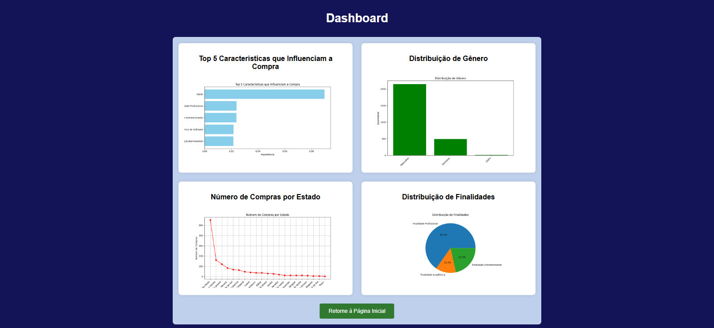
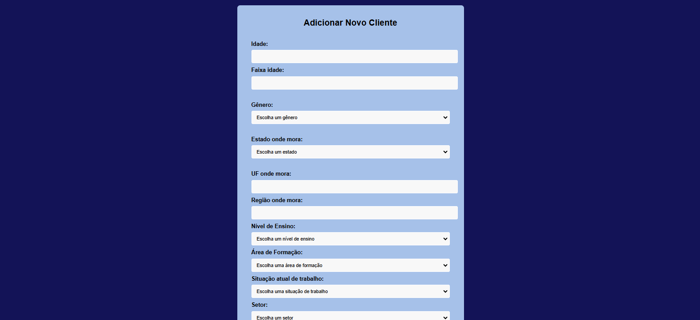
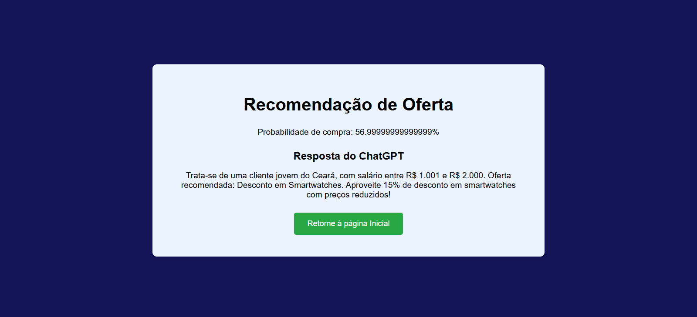

# PROJETO DE ANÁLISE DE PERFIL DE CLIENTES

## Índice
- [Objetivo do Projeto](#objetivo-do-projeto)
- [Detalhamento da Arquitetura de IA](#detalhamento-da-arquitetura-de-ia)
- [Protótipo Funcional](#protótipo-funcional)
- [Layout](#layout)
- [Como rodar este projeto?](#como-rodar-este-projeto)
- [Link](#links-do-github)

## Objetivo do Projeto

O objetivo principal do projeto é desenvolver e demonstrar um protótipo funcional que utiliza técnicas avançadas de Inteligência Artificial (IA) para otimizar o redirecionamento de ofertas e produtos aos clientes e fornecer uma visualização eficaz dos resultados de vendas para os vendedores.

## Detalhamento da Arquitetura de IA

### 1. Arquitetura Geral:

- **Camada de Pré-processamento de Dados:** Utiliza técnicas avançadas de pré-processamento para garantir que os dados sejam limpos, transformados e preparados para análise. Isso inclui o tratamento de dados ausentes, normalização de variáveis numéricas e codificação de variáveis categóricas.

- **Modelo de Classificação:** Um modelo de classificação, baseado em Random Forest, é utilizado para prever a probabilidade de compra dos clientes. Este modelo é treinado com dados históricos de clientes para identificar padrões e tendências relevantes.

- **Modelo de Recomendação:** Um modelo de K-Nearest Neighbors (KNN) é empregado para recomendar ofertas personalizadas com base nas características dos clientes e nas faixas salariais. O modelo KNN identifica as ofertas mais relevantes para cada cliente com base em similitudes nos dados.

- **Sistema de Visualização:** Inclui uma interface interativa que apresenta gráficos e visualizações dinâmicas dos dados de vendas e dos resultados de análise. Utiliza bibliotecas de visualização como Matplotlib para criar representações gráficas que ajudam os vendedores a entenderem e interpretarem os dados de forma intuitiva.

### 2. Motivos para a Escolha da Arquitetura:

- **Random Forest para Classificação:** A escolha do Random Forest é motivada pela sua robustez e capacidade de lidar com dados complexos e não lineares. Este modelo oferece alta precisão e estabilidade, mesmo com grandes conjuntos de dados e variáveis.

- **K-Nearest Neighbors para Recomendação:** O KNN é escolhido devido à sua simplicidade e eficácia na recomendação de ofertas com base em similaridade. É especialmente útil para a tarefa de identificar produtos relevantes com base em características semelhantes dos clientes.

- **Visualização Interativa:** A utilização de visualizações dinâmicas permite uma compreensão mais clara dos dados de vendas e das análises, facilitando a tomada de decisões e a identificação de tendências pelos vendedores.

### 3. Base de Dados:

- **Dados de Clientes:** Inclui informações detalhadas sobre o perfil dos clientes, como idade, gênero, estado de residência e faixa salarial. Estes dados são utilizados para treinar os modelos de classificação e recomendação.

- **Dados de Ofertas:** Contém informações sobre as ofertas disponíveis, incluindo faixas salariais e características dos produtos. Esses dados são utilizados para gerar recomendações personalizadas para cada cliente.

### 4. Implementação:

- **Pipeline de Pré-processamento:** Implementado usando a biblioteca sklearn, inclui etapas de imputação de valores ausentes, escalonamento de variáveis e codificação de variáveis categóricas.

- **Treinamento e Avaliação de Modelos:** Os modelos são treinados e avaliados usando técnicas de validação cruzada e métricas de desempenho, como a acurácia e a matriz de confusão.

- **Integração com o Frontend:** A arquitetura inclui a integração dos modelos e das visualizações com uma interface web, permitindo a interação direta com os usuários e a visualização dos resultados em tempo real.

## Protótipo Funcional

O protótipo funcional inclui três principais funcionalidades:

- **Dashboard de Análise:** Gráficos que mostram as principais características que influenciam a compra, a distribuição de gênero, o número de compras por estado e a distribuição das finalidades de uso.

- **Formulário de Adição de Cliente:** Permite a inserção de dados de novos clientes e a previsão da probabilidade de compra.

- **Recomendação de Ofertas:** Baseado na faixa salarial do cliente, o sistema recomenda ofertas adequadas.

## Layout






## Como rodar este projeto?

Para executar o projeto, siga estas etapas:

1. **Crie um ambiente virtual:**
   ```bash
   python -m venv venv 
   ```

2. **Ative o ambiente virtual:**

   No Windows (bach):
   ```bash
   source venv/Scripts/activate 
   ```

   No Windows (cmd):
   ```bash
   venv\Scripts\activate
   ```

3. **Defina a variável de ambiente para a chave da API:**

   No Windows, use o comando:
   ```bash
   export OPENAI_API_KEY="sua_chave_aqui"
   ```
   Para confirmar se funcionou, use o comando:
   ```bash
   echo $OPENAI_API_KEY
   ```

   Configuração opcional no GitHub (para pipelines):

   * No GitHub, vá até Settings > Secrets and variables > Actions.
   * Adicione um novo segredo com o nome OPENAI_API_KEY e insira a chave da API. Isso permitirá que a chave seja usada de forma segura em ações do GitHub.

4. **Instale as dependências:**
   ```bash
   pip install -r requirements.txt
   ```

5. **Execute o aplicativo Flask:**
   ```bash
   python app.py
   ```

## Links do Github
* [Visite o Github](https://github.com/GEOVANAAPROGRAMMER/Analise-de-Perfil-de-Cliente---Parte-4)
* [Visite o vídeo do projeto](https://youtu.be/0aponM-JqGg?si=GbyeBh4uD4DVB-KN)
